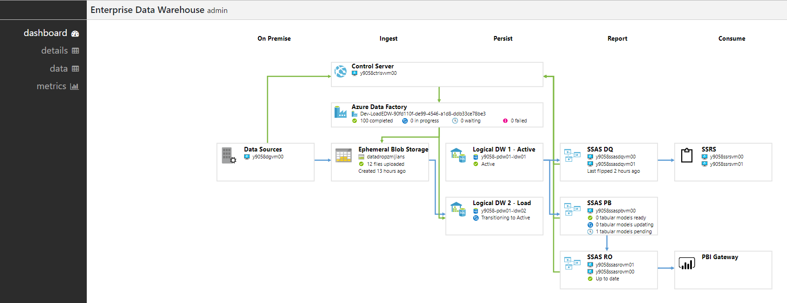

# Monitor and Troubleshoot Data Pipelines

## Summary

All data ingestion jobs are performed as one-time Azure data factory (ADF) pipelines. In the event of a pipeline failure, this document should guide you through troubleshooting any possible issues.

## Monitor the pipeline status

### Administration UI

On the Administration UI dashboard you can see an *Azure Data Factory* element. Inside this element is a numeric count for the *completed*, *in progress*, *waiting*, and *failed* data factory pipeline states. These counts should be used to monitor the states of the current pipeline jobs. 

All jobs should be completed through the normal course of a flip interval. During this interval, it's common to see pipelines in the *in progress* or *waiting* state. Each pipeline is processed on a first come first serve basis and can be delayed for a number of reason; including but not limited to table dependencies, data warehouse dependencies, maximum pipelines allowed at once.

Pipelines may also fail. If you encounter a failure it's best to try to correct immediately as it will hold up any future flip operations. Each failed pipeline will be automatically recreated and retried every 5 minutes into the max retry count is reached.

Pipeline states:
- *Completed* - Pipeline ran successfully.
- *In Progress* - Pipelines is enqueued or being processed by ADF.
- *Waiting* - Pipeline job is waiting on an internal dependency to be completed before being enqueued.
- *Failed* - The pipeline failed for an unknown reason.

### Azure Portal

The Administration UI is the best way to get a status of the overall system and its components. When you need more in-depth troubleshooting of the pipelines, it's best to work directly in the Azure portal.

To perform any troubleshooting you first need to find your data factory name. The name can found on the Administration UI dashboard in the Azure data factory element. The name should be of the format `Dev-LoadEDW-<GUID>`. Otherwise, you can find the name by directly inspecting the resources under the resource group of this deployment. There should only be one data factory for this deployment.

### Monitor & Manage Dashboard

The best way to view pipeline execution logs is through the Azure portal's *Monitor & Manage* dashboard of the data factory.

1. Login to the [Azure portal](https://portal.azure.com)
2. Search for the data factory by name.
3. In the data factory's main blade click the *Monitor & Manage* panel.
4. Set the *Start time (UTC)* and *End time (UTC)* in the middle center of the *MONITOR* tab. This date range will filter all visible activity to this range.
5. In the bottom center of the data factory *MONITOR* tab, you will see an *ACTIVITY WINDOWS*. In this window you can filter by *Type*. Most likely you will want to find *Type* of *Failed*.
6. Click the activity row under investigation. This will open an *Activity window explorer* on right hand side.

The *Activity window explorer* should give you the diagnostic issues you will need in order to determine the problem with the activity. The most useful information will be **Failed execution** error logs. Depending on the type of error encountered, you are most likely to encounter one of the following root causes:

1. A linked service is broken.
2. The data being ingested in incorrect.
3. The configuration for ingestion was incorrect.

### Additional information

Additional information on monitoring Azure data factories can be found on [Microsoft Docs](https://docs.microsoft.com/en-us/azure/data-factory/monitor-visually).

## Resolutions to Common Problems

### Fix a broken linked service

1. Login to the [Azure portal](https://portal.azure.com)
2. Search for the data factory by name.
3. In the data factory's main blade click the *Author and deploy* panel.
4. Click the linked service that is failing.
5. Correct the JSON of the linked service.
6. Click *Deploy*.
7. Wait for the pipeline to be recreated and rerun.

### Fix bad data

It's inevitable that some data you may be ingested was specified incorrectly. If you encounter a failure due to the data being bad, simply correct the data in the blob location and wait for the pipeline to be recreated and retried within 5 minutes. 

### Remove a failed job

If a pipeline is failing due to erroneously specified data, you may want to simply remove the job entirely. The can be done by performing a delete on the `DWTableAvailabilityRanges` entries that are causing the problem. This can be done by directly connecting to the `ctrldb` or through the `DWTableAVailabilityRanges` using the odata API.

> **WARNING**: There is a `DWTableAvailabilityRanges` entry for each of the Data Warehouses. Only remove the entries related to your specific FileUri if the none of them have been processed. If you remove only some entries then the Data Warehouses will get out of sync.

### Retry a pipeline that has hit its maximum retry limit

If too much time has passed before the error was corrected, the maximum retry count may have been hit. If so, you can force a retry to calling the odata function `RetryDwTableAvailabilityRangeJobs`.
